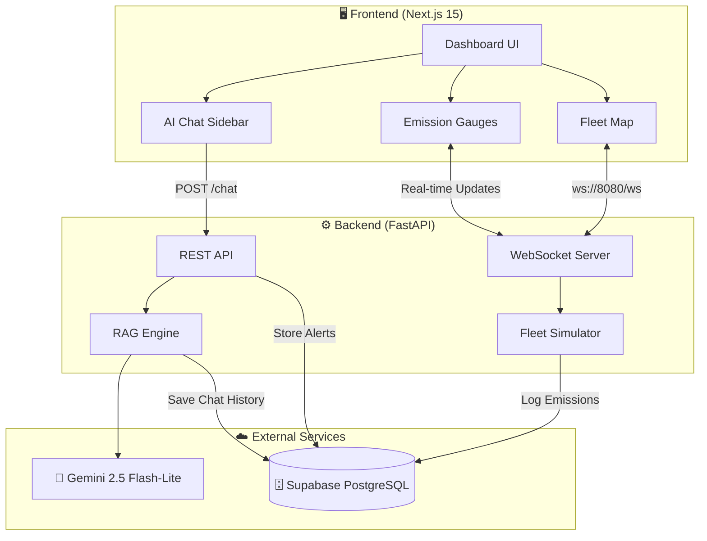
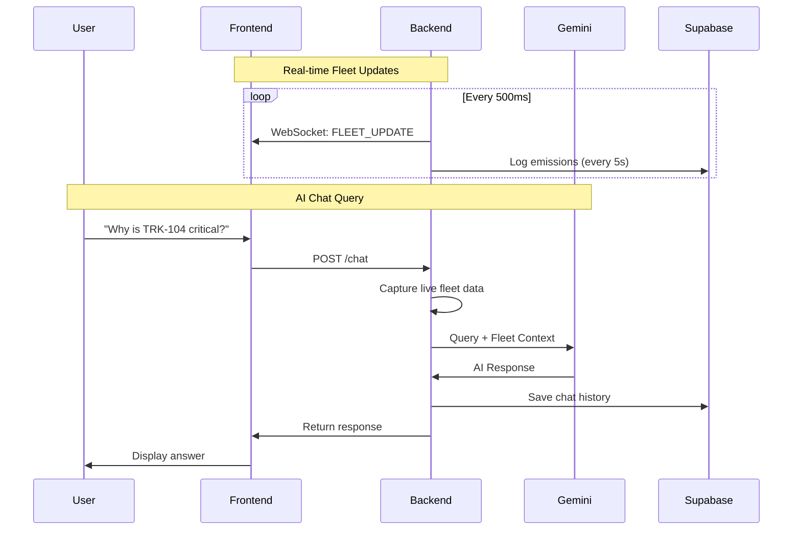
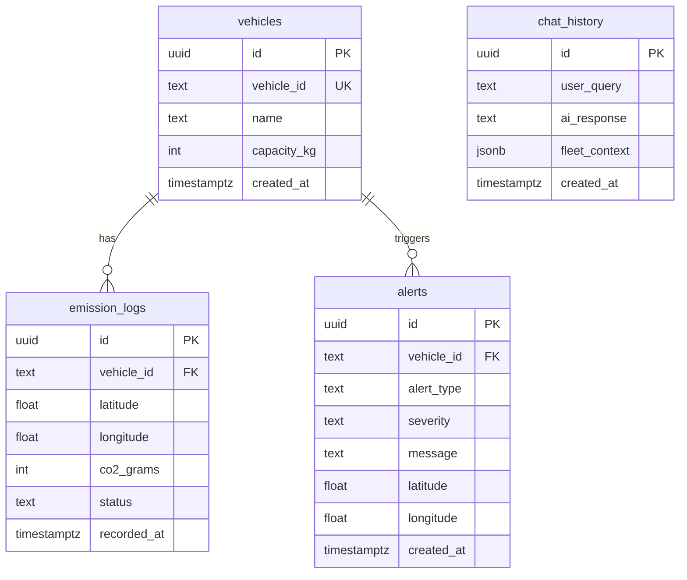

# 🌿 PathGreen-AI

> Real-time Fleet Emissions Intelligence Platform powered by **Pathway Streaming** + **Gemini 2.5 Flash**


PathGreen-AI is a real-time logistics intelligence system for monitoring fleet carbon emissions. It uses **Pathway** for streaming data pipelines and **Gemini 2.5 Flash** for RAG-powered AI chat.

**🏆 Built for Hack For Green Bharat** — India's flagship AI sustainability hackathon.

---

## ✨ Features

| Feature                       | Description                                              |
| ----------------------------- | -------------------------------------------------------- |
| 🛤️ **Pathway Streaming**      | Real-time GPS/Telemetry data pipelines                   |
| 🗺️ **Live Fleet Map**         | Dark-themed Leaflet map with color-coded vehicle markers |
| 📊 **Emission Gauges**        | Compact CO₂ tracking with status pills                   |
| 🚛 **Vehicle Status**         | Live status updates (MOVING, IDLE, WARNING, CRITICAL)    |
| 💬 **AI Chat (RAG)**          | Semantic search on BS-VI regulations + Gemini 2.5 Flash  |
| ⚡ **WebSocket Streaming**    | 500ms update intervals for real-time data                |
| 🗄️ **Persistent Database**    | Supabase PostgreSQL with RLS security                    |
| 🎨 **Brutalist UI**           | High-contrast design with character-rich typography      |
| 📑 **Tabbed Sidebar**         | Fleet / Analytics / Chat tabs for cleaner layout         |
| ↔️ **Resizable Sidebar**      | Drag to resize sidebar between 320px and 600px           |
| 🔍 **Semantic Search**        | Gemini embeddings for meaning-based regulation lookup    |
| 📈 **Analytics Dashboard**    | CO₂ trends, efficiency score, top emitters, live charts  |
| 🔒 **API Key Auth**           | Protected analytics endpoints with X-API-Key header      |
| 🛡️ **Prompt Injection Guard** | Regex + delimiter-hardened prompts block LLM attacks     |

---

## 🏗️ Architecture



### Data Flow



---

## 🛠️ Tech Stack

### Frontend

- **Framework**: Next.js 15 (App Router)
- **Language**: TypeScript
- **Mapping**: Leaflet + react-leaflet
- **Styling**: CSS Variables (Brutalist Design System)
- **Fonts**: Space Grotesk, JetBrains Mono

### Backend

- **Framework**: FastAPI
- **Streaming**: Pathway (Real-time data pipelines)
- **Server**: Uvicorn (ASGI)
- **AI**: Google Gemini 2.5 Flash
- **Protocol**: WebSocket + REST

### Database

- **Platform**: Supabase (PostgreSQL)
- **Security**: Row Level Security (RLS) enabled
- **Tables**: vehicles, emission_logs, alerts, chat_history

### Infrastructure

- **Containerization**: Docker + Docker Compose
- **Hot Reload**: Volume mounts with dev mode

---

## 🚀 Quick Start

### Prerequisites

- Docker & Docker Compose
- Gemini API Key ([Get one here](https://aistudio.google.com/apikey))
- Supabase Project ([Create here](https://supabase.com))

### 1. Clone the Repository

```bash
git clone https://github.com/your-username/pathgreen-ai.git
cd pathgreen-ai
```

### 2. Set Environment Variables

```bash
# Create .env file in project root
cat > .env << EOF
GEMINI_API_KEY=your_gemini_key
SUPABASE_URL=https://your-project.supabase.co
SUPABASE_KEY=your_service_role_key
PATHGREEN_API_KEY=$(openssl rand -hex 32)
PRODUCTION=false
EOF
```

### 3. Start the Platform

```bash
docker compose up --build
```

### 4. Open the Dashboard

- **Frontend**: [http://localhost:3000](http://localhost:3000)
- **API Docs (Custom)**: [http://localhost:3000/api-docs](http://localhost:3000/api-docs)
- **Backend Health**: [http://localhost:8080/health](http://localhost:8080/health)
- **Swagger UI**: [http://localhost:8080/docs](http://localhost:8080/docs)

---

## 📁 Project Structure

```
pathgreen-ai/
├── backend/
│   ├── main.py              # FastAPI app with Pathway integration
│   ├── gps_connector.py     # Pathway GPS/Telemetry stream subjects
│   ├── rag.py               # RAG with Pathway VectorStore + fallback
│   ├── transforms.py        # Emission calculation transforms
│   ├── schema.py            # Pathway schema definitions
│   ├── llm_handler.py       # Gemini LLM handler
│   ├── data/regulations/    # BS-VI regulation documents
│   ├── requirements.txt     # Python dependencies
│   └── Dockerfile           # Backend container
├── frontend/
│   ├── app/
│   │   ├── components/
│   │   │   ├── FleetMap.tsx        # Leaflet map component
│   │   │   ├── VehicleList.tsx     # Truck status list
│   │   │   ├── EmissionGauges.tsx  # CO₂ gauges
│   │   │   └── ChatSidebar.tsx     # AI chat interface
│   │   ├── page.tsx         # Main dashboard
│   │   ├── layout.tsx       # Root layout with fonts
│   │   └── globals.css      # Brutalist design system
│   ├── package.json
│   └── Dockerfile           # Frontend container
├── docker-compose.yml       # Dev mode with hot reload
├── .env                     # Environment variables (git-ignored)
└── README.md
```

---

## 🔧 Development

### Hot Reload Mode

The default `docker-compose.yml` enables hot reloading:

- **Backend**: `uvicorn --reload` auto-restarts on Python file changes
- **Frontend**: `pnpm dev` provides instant HMR for React components

### Local Development (Without Docker)

**Backend:**

```bash
cd backend
pip install -r requirements.txt
uvicorn main:app --host 0.0.0.0 --port 8080 --reload
```

**Frontend:**

```bash
cd frontend
pnpm install
pnpm dev
```

---

## 💬 AI Chat Examples

Ask the AI about your fleet:

| Query                         | What You Get                                   |
| ----------------------------- | ---------------------------------------------- |
| "Why is TRK-104 flagged?"     | Analysis of the critical truck's status        |
| "Which trucks have high CO2?" | List of vehicles exceeding emission thresholds |
| "What is the fleet status?"   | Summary of all vehicles with status breakdown  |

---

## 🎨 Design System

The UI follows a **Brutalist** design philosophy:

```css
--bg-void: #000000;
--bg-primary: #0a0a0a;
--accent-green: #00ff66;
--accent-red: #ff3333;
--accent-amber: #ffb800;
--border-brutal: 2px solid #333;
```

Typography uses **Space Grotesk** for headings and **JetBrains Mono** for data.

---

## 🔒 Security

PathGreen-AI implements defense-in-depth security:

| Layer                | Protection                                                            |
| -------------------- | --------------------------------------------------------------------- |
| **Authentication**   | API key (`X-API-Key` header) required on all `/analytics/*` endpoints |
| **Prompt Hardening** | Regex-based injection detection + delimiter-separated system prompts  |
| **CORS**             | Restricted to configured origins (no wildcard `*`)                    |
| **API Docs**         | Swagger/OpenAPI disabled in production (`PRODUCTION=true`)            |
| **Error Handling**   | Generic error messages — no stack traces or internal details leaked   |
| **Data Scoping**     | Explicit column selects — no `SELECT *` on database queries           |
| **Secrets**          | `.env` gitignored, no hardcoded credentials                           |

### Using Protected Endpoints

```bash
# Set your API key
export API_KEY="your_pathgreen_api_key"

# Access analytics
curl -H "X-API-Key: $API_KEY" http://localhost:8080/analytics/emissions
curl -H "X-API-Key: $API_KEY" http://localhost:8080/analytics/alerts
curl -H "X-API-Key: $API_KEY" http://localhost:8080/analytics/chat-history
```

---

## 📡 API Reference

### WebSocket: `/ws`

Streams fleet updates every 500ms:

```json
{
  "type": "FLEET_UPDATE",
  "data": [
    {
      "id": "TRK-101",
      "lat": 28.7,
      "lng": 77.1,
      "status": "MOVING",
      "co2": 450
    }
  ],
  "alerts": ["[ALERT] WARNING: EMISSION_SPIKE - TRK-102"]
}
```

### POST: `/chat`

Send a query, receive AI response:

```bash
curl -X POST http://localhost:8080/chat \
  -H "Content-Type: application/json" \
  -d '{"message": "Why is TRK-104 flagged?"}'
```

### GET: `/analytics/emissions`

Get historical emission data from database.

### GET: `/analytics/alerts`

Get alert history from database.

### GET: `/health`

Health check with service status:

```json
{
  "status": "ok",
  "version": "3.0.0",
  "engine": "pathway",
  "services": {
    "database": "connected",
    "ai": "connected",
    "pathway": "enabled",
    "rag": "ready"
  }
}
```

---

## 🗄️ Database Schema



---

## 🤝 Contributing

1. Fork the repository
2. Create a feature branch (`git checkout -b feature/amazing-feature`)
3. Commit your changes (`git commit -m 'Add amazing feature'`)
4. Push to the branch (`git push origin feature/amazing-feature`)
5. Open a Pull Request

---

## 📄 License

This project is licensed under the MIT License - see the [LICENSE](LICENSE) file for details.

---

## 🙏 Acknowledgments

- [Leaflet](https://leafletjs.com/) for the mapping library
- [CARTO](https://carto.com/) for the dark map tiles
- [Google Gemini](https://ai.google.dev/) for the AI backbone
- [FastAPI](https://fastapi.tiangolo.com/) for the blazing-fast backend
- [Supabase](https://supabase.com/) for the PostgreSQL database

---

<p align="center">
  Built with 💚 for a greener future<br/>
  <strong>Hack For Green Bharat 2026</strong>
</p>
